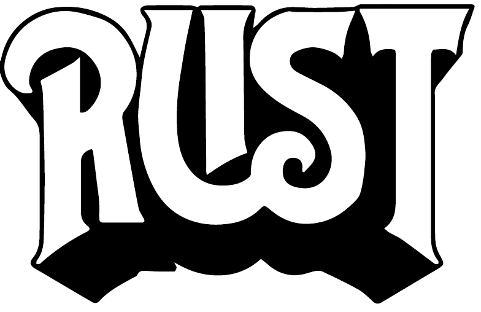

# Command-Line Rust: A Project-Based Primer for Writing Rust CLIs

This is the code repository for the [_Command-Line Rust_](https://learning.oreilly.com/library/view/command-line-rust/9781098109424/) (O'Reilly, 2022/2024, ISBN 9781098109417) 

## Author

Ken Youens-Clark <kyclark@gmail.com>

## Synopsis

For several consecutive years, Rust has been voted "most loved programming language" in Stack Overflow's annual developer survey. This open source systems programming language is now used for everything from game engines and operating systems to browser components and virtual reality simulation engines. But Rust is also an incredibly complex language with a notoriously difficult learning curve.

Rather than focus on the language as a whole, this guide teaches Rust using a single small, complete, focused program in each chapter. Author Ken Youens-Clark shows you how to start, write, and test each of these programs to create a finished product. You'll learn how to handle errors in Rust, read and write files, and use regular expressions, Rust types, structs, and more.

Discover how to:

* Use Rust's standard libraries and data types to create command-line programs
* Write and test Rust programs and functions
* Read and write files, including stdin, stdout, and stderr
* Document and validate command-line arguments
* Write programs that fail gracefully
* Parse raw and delimited text
* Use and control randomness

## Git Branches

The book was originally published in 2022, when the `clap` (command-line argument parser) crate was a v2.33.
The book was updated in 2024 to use `clap` v4, which has two patterns for parsing, _builder_ (similar to the original v2.33 code) and _derive_.
The branches are organized as follows:

* `main`: Contains the `clap` v4 _derive_ pattern
* `clap_v4_builder`: Contains the `clap` v4 _builder_ pattern
* `clap_v2`: Contains the original programs from the 2022 version of the book that use `clap` v2.33

# rust-solutions
